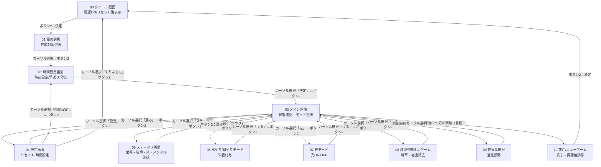

## 概要
本設計書は「ふらわっち」ゲームにおけるUIを定義したものである。  

---

## 画面一覧

| No | 画面名 | 機能概要 | 主な遷移元 | 主な遷移先 |
|----|----------|------------|--------------|--------------|
| 00 | タイトル画面 | ゲーム開始 | 電源ON / リセット後 | 種の選択 |
| 01 | 種の選択 | 育成対象の選択 | タイトル画面 | 時間設定画面 |
| 02 | 時間設定画面 | 時刻設定・早送り・一時停止 | 種の選択 / 設定画面 | メイン画面 |
| 03 | メイン画面 | 状態確認・モード選択 | 時間設定完了 / 各機能戻り | 設定画面 / ステータス画面 / 各モード |
| 04 | 設定画面 | リセット・時間変更 | メイン画面 | 時間設定 / リセット確認 / メイン画面 |
| 05 | ステータス表示画面 | パラメータ確認 | メイン画面 | メイン画面 |
| 06 | 水やり/餌やりモード | 栄養付与 | メイン画面 | メイン画面 |
| 07 | 光モード | 光のON/OFF | メイン画面 | メイン画面 |
| 08 | 環境整備ミニゲーム | 害虫駆除/雑草除去 | メイン画面 | メイン画面 |
| 09 | 花言葉選択 | 成長進化選択 | 自動（時間経過） | メイン画面 |
| 10 | 死亡/ニューゲーム | ゲーム終了→再開始誘導 | 自動（栄養0・寿命） | タイトル画面 |

---

## Mermaid 画面遷移図

---

## 遷移条件まとめ

| 遷移元 | 条件・トリガー | 遷移先 |
|---------|----------------|----------|
| タイトル画面 | ボタン2（決定） | 種の選択 |
| 種の選択 | カーソルで種を選択→ボタン2（決定） | 時間設定画面 |
| 時間設定 | カーソルで「決定」を選択→ボタン2 | メイン画面 |
| メイン画面 | カーソルで「設定」を選択→ボタン2 | 設定画面 |
| メイン画面 | カーソルで「ステータス」を選択→ボタン2 | ステータス画面 |
| メイン画面 | カーソルで「水やり」を選択→ボタン2 | 水やりモード |
| メイン画面 | カーソルで「光」を選択→ボタン2 | 光モード |
| メイン画面 | カーソルで「環境整備」を選択→ボタン2 | 環境整備ミニゲーム |
| メイン画面 | 栄養0 or 寿命到達（自動） | 死亡/ニューゲーム画面 |
| メイン画面 | 成長タイマー到達（自動） | 花言葉選択画面 |
| 設定画面 | カーソルで「時間設定」を選択→ボタン2 | 時間設定画面 |
| 設定画面 | カーソルで「やりなおし」を選択→ボタン2 | タイトル画面 |
| 設定画面 | カーソルで「戻る」を選択→ボタン2 | メイン画面 |
| ステータス画面 | ボタン2（決定）またはカーソルで「戻る」選択 | メイン画面 |
| 各モード画面 | ボタン2（決定）またはカーソルで「戻る」選択 | メイン画面 |
| 花言葉選択 | カーソルで選択肢を選択→ボタン2 | メイン画面 |
| 死亡/ニューゲーム | ボタン2（決定） | タイトル画面 |

---

## 制約・例外ルール

| 項目 | 内容 |
|------|------|
| 水やり/餌やりモード | 同じ行動を1時間内に3回以上行うと効果無効 |
| 水やり/餌やりモード | 睡眠時間に関係なく常時操作可能（24時間世話が必要） |
| 光モード/ミニゲーム | 睡眠中（22時〜6時）は操作不可 |
| 花言葉選択・死亡画面 | 自動遷移以外での表示なし |
| リセット | 「やりなおす」選択時にデータ削除・初期化 |
| 解像度 | 画面は、128×128ピクセルのドット表示 |

---

## 各画面のメニュー構成

### タイトル画面（00）
- 選択肢なし（ボタン2で次へ）

### 種の選択画面（01）
- 選択肢（縦並び、ボタン1/3で移動）：
  1. 日
  2. 月
- ボタン2で決定

### 時間設定画面（02）
- 選択肢（縦並び、ボタン1/3で移動）：
  1. 一時停止 ON/OFF（切り替え）
  2. 時間スケール 変更（1.0x → 4.0x → 0.25x を循環）
  3. 決定（メイン画面へ）

### メイン画面（03）
- **キャラクター表示**: 中央に擬人化されたキャラクターを表示。表情・ポーズで状態を視覚的に表現
  - 成長段階（種・芽・茎・蕾・花）に応じたデザイン
  - 栄養・環境・メンタル状態に応じた表情の変化
- **選択肢**（縦並び、ボタン1/3で移動）：
  1. ステータス表示（詳細な数値確認）
  2. 水やり
  3. 光
  4. 環境整備
  5. 設定
- ボタン2で各機能を実行
- **注意**: 定量表示（水・光バー、雑草・害虫・環境・言葉の数値）は表示しない。詳細はステータス画面で確認

### 設定画面（04）
- 選択肢（縦並び、ボタン1/3で移動）：
  1. 時間設定変更
  2. やりなおし
  3. 戻る
- ボタン2で決定

### ステータス表示画面（05）
- 選択肢：
  1. 戻る
- ボタン2で戻る

### 水やり/餌やりモード（06）
- 選択肢（横並び、ボタン1/3で移動）：
  1. 水やり実行
  2. 肥料実行
  3. 戻る
- ボタン2で決定

### 光モード（07）
- 選択肢（横並び、ボタン1/3で移動）：
  1. 光 ON
  2. 光 OFF
  3. 戻る
- ボタン2で決定

### 環境整備ミニゲーム（08）
- 選択肢（横並び、ボタン1/3で移動）：
  1. 雑草除去実行
  2. 害虫駆除実行
  3. 戻る
- ボタン2で決定

### 花言葉選択画面（09）
- 選択肢（縦並び、ボタン1/3で移動）：
  1. 「好き」を伝える
  2. 「嫌い」を伝える
- ボタン2で決定

### 死亡/ニューゲーム画面（10）
- 選択肢なし（ボタン2でタイトルへ）

---
