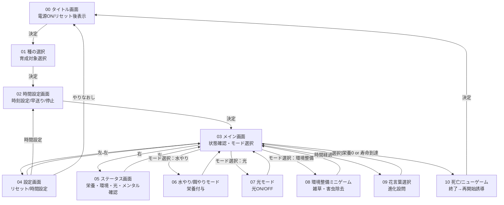

## 概要
本設計書は「ふらわっち」ゲームにおけるUIを定義したものである。  

---

## 画面一覧

| No | 画面名 | 機能概要 | 主な遷移元 | 主な遷移先 |
|----|----------|------------|--------------|--------------|
| 00 | タイトル画面 | ゲーム開始 | 電源ON / リセット後 | 種の選択 |
| 01 | 種の選択 | 育成対象の選択 | タイトル画面 | 時間設定画面 |
| 02 | 時間設定画面 | 時刻設定・早送り・一時停止 | 種の選択 / 設定画面 | メイン画面 |
| 03 | メイン画面 | 状態確認・モード選択 | 時間設定完了 / 各機能戻り | 設定画面 / ステータス画面 / 各モード |
| 04 | 設定画面 | リセット・時間変更 | メイン画面 | 時間設定 / リセット確認 / メイン画面 |
| 05 | ステータス表示画面 | パラメータ確認 | メイン画面 | メイン画面 |
| 06 | 水やり/餌やりモード | 栄養付与 | メイン画面 | メイン画面 |
| 07 | 光モード | 光のON/OFF | メイン画面 | メイン画面 |
| 08 | 環境整備ミニゲーム | 害虫駆除/雑草除去 | メイン画面 | メイン画面 |
| 09 | 花言葉選択 | 成長進化選択 | 自動（時間経過） | メイン画面 |
| 10 | 死亡/ニューゲーム | ゲーム終了→再開始誘導 | 自動（栄養0・寿命） | タイトル画面 |

---

## Mermaid 画面遷移図

---

## 遷移条件まとめ

| 遷移元 | 条件・トリガー | 遷移先 |
|---------|----------------|----------|
| タイトル画面 | 「決定」 | 種の選択 |
| 種の選択 | 種を決定 | 時間設定画面 |
| 時間設定 | 設定完了 | メイン画面 |
| メイン画面 | 左ボタン | 設定画面 |
| メイン画面 | 右ボタン | ステータス画面 |
| メイン画面 | モード選択 | 各モード（06–08） |
| メイン画面 | 栄養0 or 寿命到達 | 死亡/ニューゲーム画面 |
| メイン画面 | 成長タイマー到達 | 花言葉選択画面 |
| 設定画面 | 「時間設定」選択 | 時間設定画面 |
| 設定画面 | 「やりなおし」選択 | タイトル画面 |
| 花言葉選択 | 回答完了 | メイン画面 |
| 死亡/ニューゲーム | 決定 | タイトル画面 |

---

## 制約・例外ルール

| 項目 | 内容 |
|------|------|
| 水やり/餌やりモード | 同じ行動を1時間内に3回以上行うと効果無効 |
| 光モード/ミニゲーム | 睡眠中は操作不可 |
| 花言葉選択・死亡画面 | 自動遷移以外での表示なし |
| リセット | 「やりなおす」選択時にデータ削除・初期化 |
| 解像度 | 画面は、128×128ピクセルのドット表示 |

---
